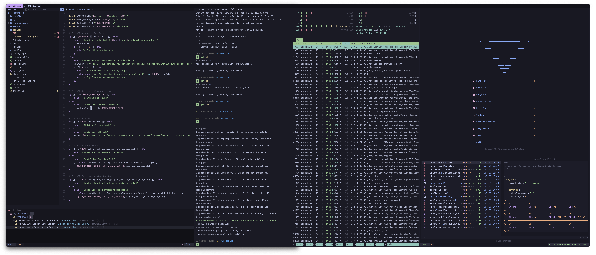

# Personal System Config (without [Nix](https://nixos.org/))

This branch uses [Homebrew](https://brew.sh), [mise-en-place](https://mise.jdx.dev), [GNU Stow](https://www.gnu.org/software/stow/), and custom [Zsh](https://www.zsh.org/) scripts to configure macOS on machines I'm not allowed to use of [Nix](https://nixos.org/) on.

I try my best to keep this and [my Nix-based configuration](https://github.com/minusfive/tree/main) synchronized, but there are some inherent differences in the way things are configured and managed, and depending on which type of machine I'm working with more regularly, I may prioritize one configuration over the other.

> [!NOTE]
> This configuration includes several keyboard shortcuts (for app launching, window management, text editing, etc.), optimized to work with [my custom keyboard layout](https://github.com/minusfive/zmk-config) and workflow. To customize you'll likely want to primarily look at the following configurations:
>
> - [Hammerspoon](./.config/hammerspoon/)
> - [Wezterm](./.config/wezterm/)
> - [NeoVim](./.config/nvim/)

## Setup

> [!WARNING]
> This will modify system settings, install and configure software. You should read and understand [the init script](./scripts/init.zsh) and the [other scripts it calls](./scripts/) before proceeding.

To setup a new machine or update a current one, run:

```sh
git clone git@github.com:minusfive/dot.git ~/dev/dot
cd ~/dev/dot
./scripts/init.zsh
```

## Programs

- Most of the programs I use are installed via [Homebrew](https://brew.sh) using my [Brewfile](./scripts/Brewfile)
- Some are installed and managed by [mise-en-place](https://mise.jdx.dev), as defined in the following files:

  - [~/.config/mise/config.toml](./.config/mise/config.toml)
  - [~/.config/mise/default_packages_node](./.config/mise/default_packages_node)
  - [~/.config/mise/default_packages_python](./.config/mise/default_packages_python)
  - [~/.config/mise/default_packages_ruby](./.config/mise/default_packages_ruby)

- Others are directly installed through the [Zsh scripts](./scripts/)

---


